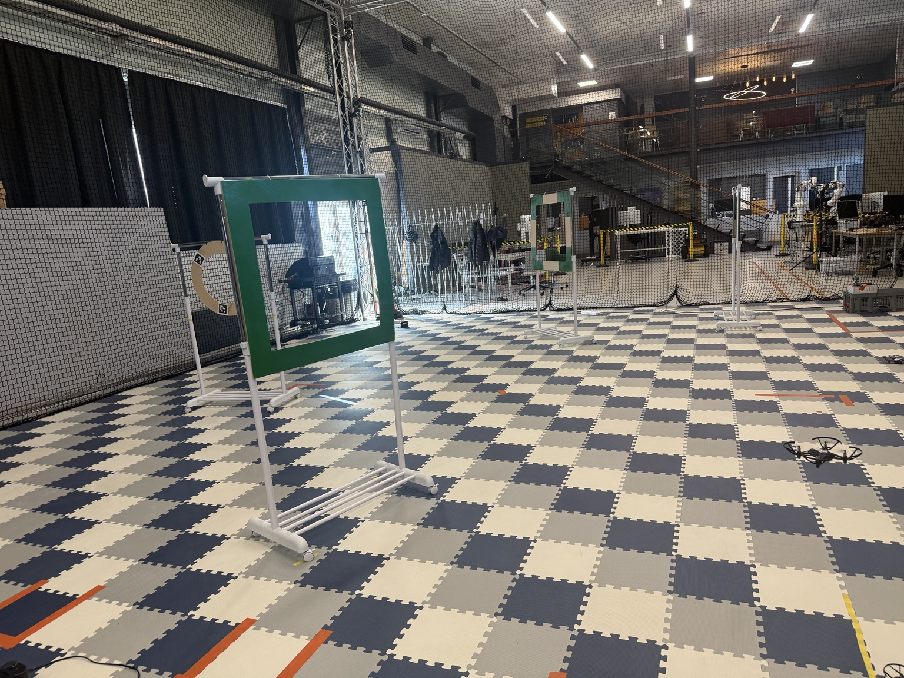
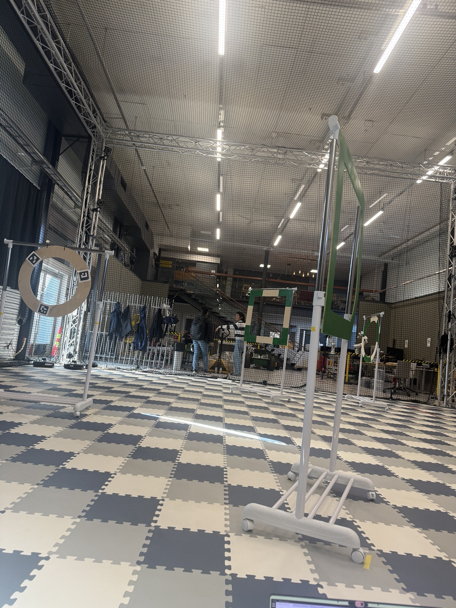
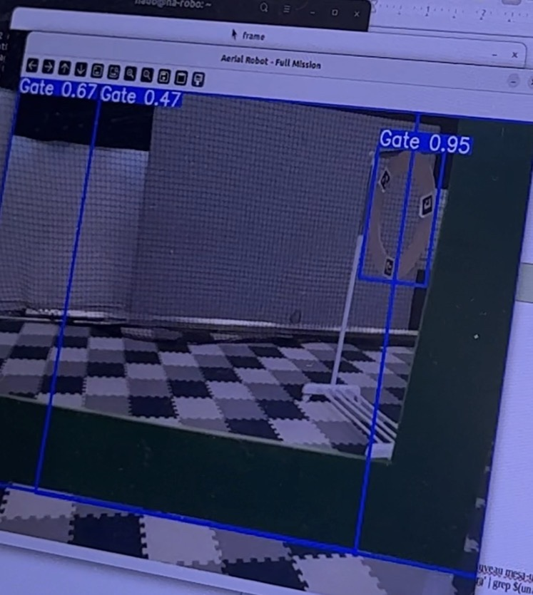

# Tello YOLO Gate Navigation

Autonomous ROS 2 vision-based navigation for a DJI/Ryze Tello drone using YOLO gate detection and PID control.

## Physical Test Environment

Real indoor test course used during validation.

<p align="center">
  
  
</p>

Gate sequence:

1. Square gate
2. Circular gate
3. Square gate
4. Circular gate

The physical setup includes real-world constraints:

- Indoor lighting variation
- Background clutter
- Safety net enclosure
- Gate angle variation
- Flight drift and battery-dependent behavior

## Real-Time Gate Detection

The system uses YOLO-based gate detection during autonomous navigation. The drone camera stream is processed in real time to identify racing gates and guide alignment.

<p align="center">
  
</p>

Example output showing multiple gate detections in a real indoor test environment.

## Demo


Full demo:

[tello_gate_navigation_demo.mp4](media/tello_gate_navigation_demo.mp4)

## Features

- ROS 2 Humble
- Tello drone control using `/cmd_vel`
- YOLO-based gate and stop-sign detection
- PID yaw and altitude alignment
- Finite State Machine navigation
- Autonomous gate penetration
- Recovery logic after temporary target loss
- Real-world indoor testing
- Demo recording through all gates

## Project Structure

```text
src/
├── my_tello_vision/
│   ├── launch/
│   ├── models/
│   ├── my_tello_vision/
│   ├── simulation/
│   ├── package.xml
│   └── setup.py
│
├── tello_ros2_humble_driver/
│   └── tello_ros/

docs/
└── images/
    ├── course_front.jpg
    ├── course_side.jpg
    └── yolo_detection_demo.jpg

media/
├── tello_gate_navigation_preview.gif
└── tello_gate_navigation_demo.mp4
```

## Main Control Node

```text
src/my_tello_vision/my_tello_vision/tello_vision_control.py
```

## Requirements

- Ubuntu 22.04
- ROS 2 Humble
- Python 3
- OpenCV
- cv_bridge
- Ultralytics YOLO
- Tello ROS 2 driver
- DJI/Ryze Tello drone

Install Python dependencies:

```bash
pip install ultralytics opencv-python
```

Install dependency:

```bash
sudo apt install libh264-dev
```

## Clone

```bash
mkdir -p ~/ros2_ws/src

cd ~/ros2_ws/src

git clone https://github.com/khanhhado1208/Tello-yolo-gate-navigation.git
```

## Build

```bash
cd ~/ros2_ws

colcon build

source install/setup.bash
```

## Running the Mission

Open a new terminal for each step.

### Step 1 — Connect to Tello Wi-Fi

Power on the DJI/Ryze Tello drone.

Connect the computer to the Tello Wi-Fi network.

### Step 2 — Launch Driver

```bash
cd ~/ros2_ws

source install/setup.bash

ros2 launch tello_driver tello_driver.launch.py
```

If needed:

```bash
find src/tello_ros2_humble_driver -name "*.launch.py"
```

### Step 3 — Run Autonomous Navigation

```bash
cd ~/ros2_ws

source install/setup.bash

ros2 run my_tello_vision tello_vision_control
```

### Optional — Record Camera Stream

```bash
cd ~/ros2_ws

source install/setup.bash

ros2 run my_tello_vision record_tello
```

## Navigation Logic

The controller uses a finite state machine.

### SEARCH

Searches for gates or stop signs.

### ALIGN

Uses PID control to align the drone with the detected gate center.

### PENETRATE

Moves forward through the gate while compensating altitude loss.

### BRAKE

Applies short braking after gate penetration.

### RECOVERY

Uses previous target direction if detections are temporarily lost.

### LAND

Performs landing after stop-sign detection.

## Control Strategy

The controller combines:

- YOLO-based gate detection
- Stop-sign detection
- PID yaw correction
- PID altitude correction
- Forward velocity control
- Finite State Machine mission sequencing
- Conservative control tuning for low-cost drone stability

## Reliability Notes

This project was tested on a low-cost DJI/Ryze Tello drone in a real indoor gate course.

Flight behavior can vary because of:

- Battery level
- Motor temperature
- Wi-Fi latency
- Video latency
- Lighting conditions
- Drift accumulation

A fully charged battery can produce stronger motion for identical velocity commands.

Battery discharge may slightly smooth flight behavior but excessive discharge can also reduce altitude stability.

For repeatability:

- Use consistent battery level
- Keep gate placement unchanged
- Maintain stable lighting
- Avoid over-tuning for a single successful run
- Prefer moderate speeds over aggressive control gains

## Notes

The controller was designed for a four-gate indoor course with a final stop sign target.

Performance depends on environmental conditions and Tello flight limitations.